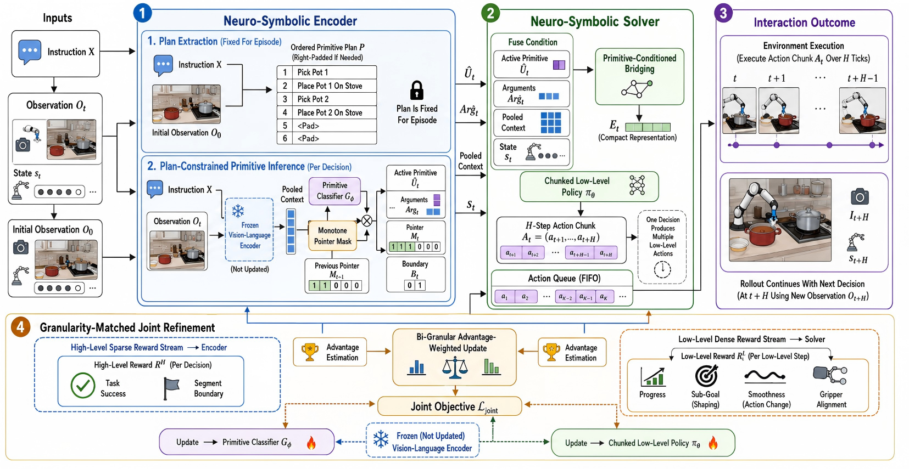

<div align="center">

# NS-VLA: Towards Neuro-Symbolic Vision-Language-Action Models

[](https://arxiv.org/abs/XXXX.XXXXX)
[](https://zuzuzzy.github.io/NS-VLA/)
[](https://huggingface.co/zuzuzzy/NS-VLA)
[](https://huggingface.co/datasets/zuzuzzy/NS-VLA-Dataset)
[](LICENSE)

[**Homepage**](https://zuzuzzy.github.io/NS-VLA/) | [**Paper**](https://arxiv.org/abs/XXXX.XXXXX) | [**Model**](https://huggingface.co/zuzuzzy/NS-VLA) | [**Dataset**](https://huggingface.co/datasets/zuzuzzy/NS-VLA-Dataset)
</div>

## Overview

**NS-VLA** is a novel **Neuro-Symbolic Vision-Language-Action** framework for robotic manipulation. It introduces:

- 🧩 **Neuro-Symbolic Encoder**: Grounds the instruction-conditioned history into a discrete primitive, extracting an episode-level plan once and then advancing a monotone pointer along it
- ⚡ **Neuro-Symbolic Solver**: Bridges the active primitive to a backbone-agnostic policy through primitive-conditioned bridging, emitting open-loop action chunks
- 🔄 **Hierarchical Joint Policy Optimization**: Updates both factors under reward streams matched to their granularity, coupling H-GRPO on primitive selection with AWR on chunked control

<p align="center">
  
</p>

## Performance

Success rate (SR) under the 1-shot setting, averaged over the four LIBERO suites in distribution and over the perturbed LIBERO-Plus suites. Robustness is the ratio of LIBERO-Plus average SR to LIBERO average SR, in percent.

| Method | LIBERO (1-shot) | LIBERO-Plus (OOD) | Robustness |
|:---|:---:|:---:|:---:|
| Diffusion Policy | 17.2 | 6.0 | 34.9 |
| OpenVLA | 35.7 | 12.5 | 35.0 |
| π₀ | 37.4 | 12.5 | 33.4 |
| WorldVLA | 38.3 | 10.3 | 26.8 |
| NORA | 38.3 | 13.5 | 35.2 |
| OpenVLA-OFT | 48.9 | 18.5 | 37.8 |
| π₀-Fast | 50.0 | 20.5 | 41.0 |
| VLA-RL | 53.0 | 20.8 | 39.2 |
| UniVLA | 55.1 | 19.8 | 35.9 |
| SimpleVLA-RL | 55.3 | 24.8 | 44.8 |
| RIPT-VLA | 59.3 | 27.8 | 46.8 |
| VLA-Adapter | 65.3 | 28.0 | 42.9 |
| **NS-VLA (Ours)** | **69.1** | **49.8** | **72.0** |

## Installation

```bash
# Clone the repository
git clone https://github.com/Zuzuzzy/NS-VLA.git
cd NS-VLA

# Create conda environment
conda create -n nsvla python=3.10 -y
conda activate nsvla

# Install dependencies
pip install -r requirements.txt
```

## Project Structure

```
NS-VLA/
├── configs/                  # Training and evaluation configurations
│   ├── train/
│   └── eval/
├── nsvla/                    # Core NS-VLA framework
│   ├── encoder/              # Neuro-Symbolic Encoder
│   ├── solver/               # Neuro-Symbolic Solver
│   ├── rl/                   # Hierarchical Joint Policy Optimization
│   ├── primitives/           # Primitive definitions and classifier
│   ├── envs/                 # Benchmark environment wrappers
│   ├── eval/                 # Trace schema and metrics
│   ├── train/                # Supervised training stages
│   └── utils/                # Utility functions
├── scripts/                  # Training and evaluation scripts
│   ├── train.sh
│   ├── eval.sh
│   └── annotate.sh
├── data/                     # Data processing and primitives
│   ├── prepare_1shot.py
│   ├── annotate_demos.py
│   └── extract_features.py
├── assets/                   # Figures and media
├── requirements.txt
├── pyproject.toml
├── LICENSE
└── README.md
```

## Quick Start

### Training

```bash
# Stage I: Supervised pretraining
bash scripts/train.sh --stage pretrain --config configs/train/pretrain.yaml

# Stage II: Hierarchical Joint Policy Optimization
bash scripts/train.sh --stage rl --config configs/train/rl_grpo.yaml
```

### Evaluation

```bash
# Evaluate on LIBERO
bash scripts/eval.sh --benchmark libero --checkpoint path/to/checkpoint

# Evaluate on LIBERO-Plus
bash scripts/eval.sh --benchmark libero_plus --checkpoint path/to/checkpoint
```

## Citation

If you find our work useful, please consider citing:

```bibtex
@article{zhu2026nsvla,
  title={NS-VLA: Towards Neuro-Symbolic Vision-Language-Action Models},
  author={Zhu, Ziyue and Wu, Shangyang and Zhao, Shuai and Zhao, Zhiqiu and Li, Shengjie and Wang, Yi and Li, Fang and Luo, Haoran},
  journal={arXiv preprint arXiv:XXXX.XXXXX},
  year={2026}
}
```

## Acknowledgement

We thank the developers of [LIBERO](https://github.com/Lifelong-Robot-Learning/LIBERO), [CALVIN](https://github.com/mees/calvin), [OpenVLA](https://github.com/openvla/openvla), [VLA-Adapter](https://github.com/OpenHelix-Team/VLA-Adapter), and [Qwen-VL](https://github.com/QwenLM/Qwen-VL) for their open-source contributions.

## License

This project is licensed under the Apache License 2.0 - see the [LICENSE](LICENSE) file for details.
